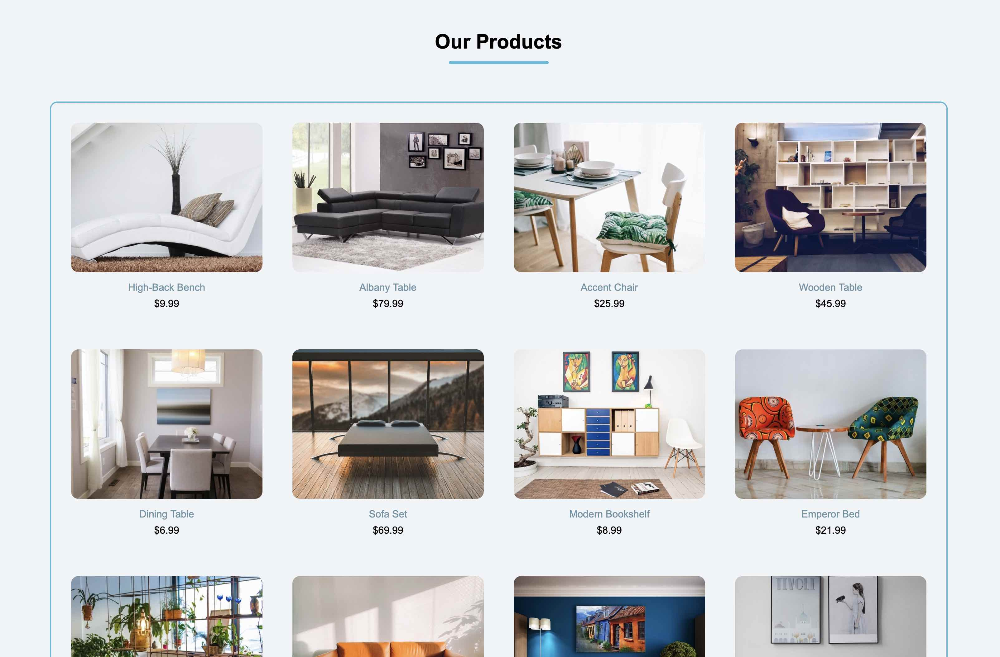

# John Smilga Course - Coded by Abraham Orherhe

## Welcome! 👋

### Links

- Solution URL: [solution](https://github.com/aeorherhe/products.git)
- Live Site URL: [live site](https://aeorherhe-products-page.netlify.app/)

### Built with

- Semantic HTML5 markup
- CSS custom properties
- Flexbox
- Mobile-first workflow
- Vanila JavaScript
- ES6 modules
- URLSearchParams
- Window location search
- document.title

## Author

- Github - [aeorherhe](https://github.com/aeorherhe)
- Frontend Mentor - [aeorherhe](https://www.frontendmentor.io/profile/aeorherhe)
- Twitter - [aeorherhe](https://twitter.com/aeorherhe)
- LinkedIn - [aeorherhe](https://www.linkedin.com/in/aeorherhe/)
- Instagram - [aeorherhe](https://www.instagram.com/aeorherhe/)
